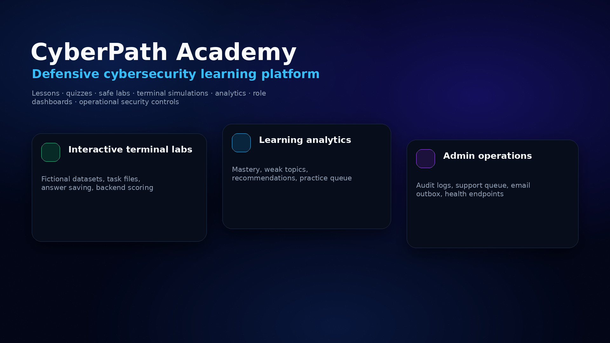
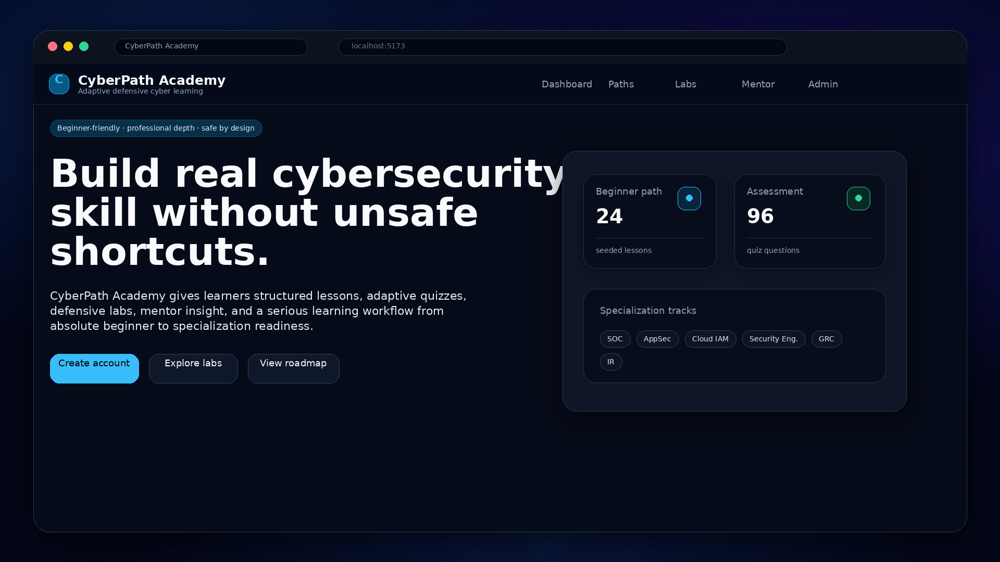
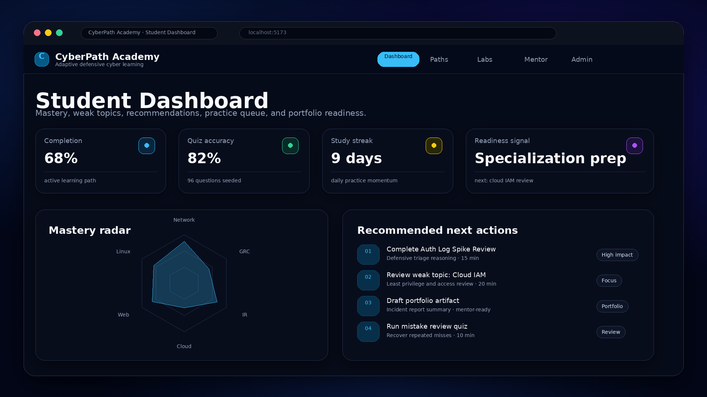
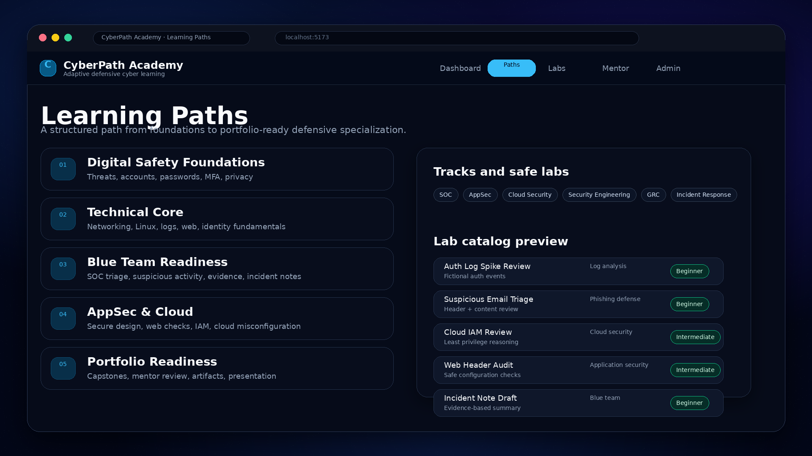
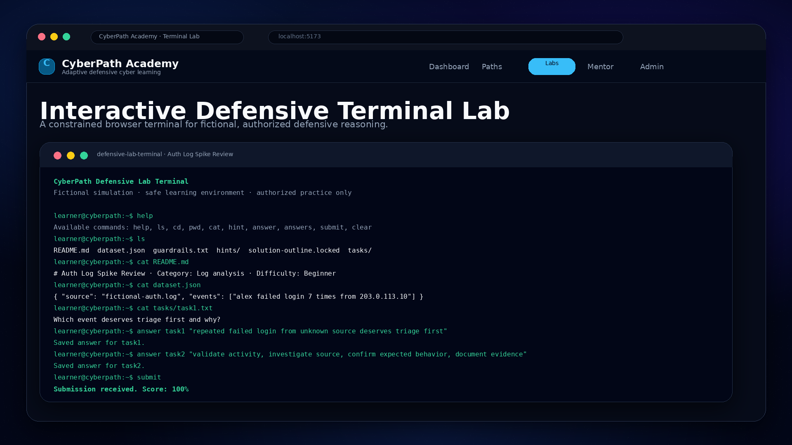
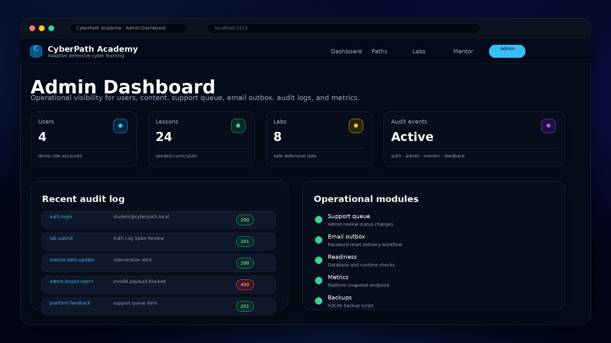

# CyberPath Academy

> A full-stack defensive cybersecurity learning platform with structured lessons, quizzes, analytics, role-based dashboards, safe labs, and browser-based terminal simulations for fictional, authorized practice.


CyberPath Academy is a mobile-first cybersecurity learning platform built to help beginners move from basic digital safety to specialization readiness.

It combines guided lessons, quizzes, defensive labs, terminal-based simulations, analytics, mistake tracking, mentor workflows, admin tools, support flows, and operational security controls.

The project is intentionally designed around **defensive, fictional, authorized cybersecurity education**. It does not teach live-target exploitation, credential theft, malware deployment, persistence, evasion, or harmful offensive workflows.

---

## Table of Contents

- [Problem](#problem)
- [Solution](#solution)
- [What Makes This Project Serious](#what-makes-this-project-serious)
- [Product Overview](#product-overview)
- [Interactive Defensive Terminal Labs](#interactive-defensive-terminal-labs)
- [Architecture](#architecture)
- [Security Model](#security-model)
- [Seeded Content](#seeded-content)
- [Tech Stack](#tech-stack)
- [Quick Start](#quick-start)
- [Demo Accounts](#demo-accounts)
- [Reviewer Walkthrough](#reviewer-walkthrough)
- [Verification](#verification)
- [Database and Backups](#database-and-backups)
- [Environment Variables](#environment-variables)
- [Operational Endpoints](#operational-endpoints)
- [Docker](#docker)
- [Replit Deployment](#replit-deployment)
- [Project Structure](#project-structure)
- [Current Limitations](#current-limitations)
- [Roadmap](#roadmap)
- [Portfolio Positioning](#portfolio-positioning)
- [License](#license)

---

## Problem

Many beginner cybersecurity resources have two major weaknesses:

1. They are too theoretical and do not connect concepts to realistic defensive workflows.
2. They push learners toward unsafe or unrealistic “hacking” content before they understand ethics, authorization, evidence, documentation, and risk reduction.

For beginners, this creates a bad learning path. They may memorize terms without learning how security work actually happens, or they may jump into offensive material without understanding professional boundaries.

---

## Solution

CyberPath Academy solves this by giving learners a safer, structured environment where they can:

- learn cybersecurity fundamentals step by step
- practice with fictional datasets instead of real targets
- receive scored feedback from quizzes and labs
- track weak topics and repeated mistakes
- practice professional defensive reasoning
- learn triage, documentation, access review, least privilege, incident reasoning, and secure design
- build portfolio-style evidence without crossing safety boundaries

The goal is not to glamorize hacking. The goal is to train clear, ethical, evidence-based cybersecurity thinking.

---

## What Makes This Project Serious

CyberPath Academy is not just a landing page, static course list, or UI demo. It includes multiple layers of real product and engineering work.

| Area | What is implemented |
|---|---|
| Learning system | Lessons, objectives, glossary, examples, checks, quizzes, mistakes, review queue, practice hub |
| Defensive labs | Fictional datasets, safe prompts, written analysis mode, terminal simulation mode, backend scoring |
| Terminal simulation | Browser-based shell with `help`, `ls`, `cat`, `hint`, `answer`, `answers`, and `submit` commands |
| Role workflows | Student, mentor, and admin dashboards |
| Analytics | Completion, quiz accuracy, weak topics, time studied, streaks, readiness, mastery, recommendations |
| Security controls | Student-only public signup, password rules, bcrypt hashing, signed httpOnly cookie, rate limits, origin checks, audit logs |
| Operations | Health/readiness endpoints, metrics endpoint, backup script, Docker support, CI workflow, deployment manifest |
| Documentation | README, security policy, contributing guide, issue templates, pull request template, launch checklist |

---
## Screenshots

### Landing Page



### Student Dashboard



### Learning Paths



### Interactive Defensive Terminal Lab



### Admin Dashboard



---
## Product Overview

### Learner Experience

CyberPath Academy gives students a structured learning journey.

Key learner features:

- mobile-first interface
- personalized onboarding based on goal, experience level, and placement score
- structured learning paths across beginner, technical core, blue-team, AppSec, cloud, and professionalization phases
- lesson pages with objectives, explanations, glossary, examples, knowledge checks, common mistakes, and relevance notes
- quiz engine with multiple-choice, multi-select, true/false, matching, short-response, and scenario-style questions
- mistake notebook for repeated misses and learner notes
- practice hub with daily quest, focus areas, review queue, assignments, and path signals
- readiness and mastery indicators to guide the next learning step

### Lab Experience

CyberPath Academy includes defensive labs that train analysis, evidence gathering, and safe reasoning.

Lab features:

- 8 seeded safe labs using fictional datasets
- written mode for structured evidence-based analysis
- terminal mode for interactive defensive practice
- safety guardrails displayed inside each lab
- backend scoring based on expected defensive reasoning keywords
- solution outline shown after submission
- fictional datasets only
- no live target interaction

### Mentor Experience

CyberPath Academy supports mentor-style learning workflows.

Mentor features:

- assigned-student visibility
- student progress review
- intervention alerts
- cohort support
- mentor feedback
- assignment workflows
- student learning signals and weak-area visibility

### Admin Experience

CyberPath Academy includes admin surfaces for platform operation.

Admin features:

- user overview
- lesson and lab administration surfaces
- support queue
- email outbox
- audit logs
- platform metrics
- operational overview

---

## Interactive Defensive Terminal Labs

CyberPath Academy includes a browser-based terminal lab mode. It gives learners a simulated shell for safe, fictional, defensive cybersecurity practice.

The terminal does **not** run real system commands. It exposes a constrained lab filesystem and routes learner answers to the backend scoring endpoint.

Example terminal workflow:

```bash
help
ls
cat README.md
cat dataset.json
ls tasks
cat tasks/task1.txt
cat tasks/task2.txt
answer task1 "repeated failed login from an unknown source deserves triage first"
answer task2 "validate the login activity, investigate the source, confirm expected behavior, and document evidence before containment"
answers
submit
```

Supported terminal behaviors:

| Command | Purpose |
|---|---|
| `help` | Lists available commands |
| `ls` | Shows files in the simulated lab filesystem |
| `cat README.md` | Reads the lab briefing |
| `cat dataset.json` | Inspects the fictional dataset |
| `ls tasks` | Lists task files |
| `cat tasks/task1.txt` | Reads a specific task prompt |
| `hint` | Reveals safe guidance |
| `answer task1 "..."` | Saves an evidence-based answer |
| `answers` | Reviews saved answers |
| `submit` | Sends answers to the backend scoring endpoint |

Manual smoke test result:

- terminal opened successfully
- dataset and task files were readable
- answers were saved correctly
- submission reached 100% after both required tasks were completed
- backend returned scored feedback to the terminal and page UI

The terminal is intentionally constrained. It does not run real system commands, does not touch live targets, and does not teach harmful workflows. It exists to make defensive reasoning more interactive.

---

## Architecture

```text
Browser / PWA
  |
  |  React + TypeScript + Tailwind + Vite
  |  Student UI, mentor UI, admin UI, lessons, quizzes, labs, terminal simulation
  v
Express API
  |
  |  Auth, learning routes, lab scoring, analytics, mentor/admin workflows,
  |  support queue, email outbox, audit logs, metrics, health, readiness
  v
SQLite Database
  |
  |  users, lessons, quiz questions, progress, mistakes, labs, lab submissions,
  |  mentor feedback, audit logs, support feedback, email outbox, subscriptions,
  |  tracks, certificates, cohorts, assignments, review queue, projects
```

High-level flow:

1. Learner logs in through signed httpOnly cookie authentication.
2. Learner opens lessons, quizzes, labs, dashboard, or practice hub.
3. Frontend calls the Express API with credentials included.
4. Backend validates requests, checks role boundaries, and reads/writes SQLite.
5. Lab and quiz submissions generate scored feedback and learning signals.
6. Dashboards expose progress, recommendations, review items, mastery, and portfolio evidence.

---

## Security Model

CyberPath Academy is built around defensive and authorized learning.

### Application Security Controls

Implemented controls include:

- public sign-up locked to the `student` role
- stronger password rules
- bcrypt password hashing
- signed httpOnly session cookies
- auth-sensitive rate limits
- general API rate limiting
- origin checks for state-changing requests
- role-based boundaries for student, mentor, and admin capabilities
- audit logs for auth, mentor, admin, billing-demo, and feedback actions
- password reset token workflow with email outbox record
- health and readiness endpoints
- backup script for SQLite database

### Content Safety Controls

The platform avoids:

- credential theft guidance
- malware deployment guidance
- persistence or evasion guidance
- live-target exploitation workflows
- harmful offensive playbooks
- instructions for attacking real systems

The platform uses:

- fictional datasets
- toy examples
- defensive analysis prompts
- authorization reminders
- constrained browser terminal simulation
- scoring based on defensive reasoning

---

## Seeded Content

The demo database includes:

- 24 lessons
- 96 quiz questions
- 8 safe labs
- 5 capstone ideas
- 30 glossary terms
- role-mapped specialization tracks
- demo users for student, mentor, and admin workflows

---

## Tech Stack

### Frontend

- React
- TypeScript
- Tailwind CSS
- Vite
- React Router
- Recharts
- vite-plugin-pwa
- xterm-based browser terminal lab interface

### Backend

- Node.js 22+
- Express
- TypeScript
- SQLite through Node.js `node:sqlite`
- Zod validation
- bcrypt password hashing
- signed session cookies
- express-rate-limit
- helmet

### Tooling and Operations

- npm workspaces
- GitHub Actions CI workflow
- Dockerfile
- docker-compose
- Render deployment manifest
- issue templates
- pull request template
- CONTRIBUTING guide
- SECURITY policy
- MIT license
- EditorConfig

---

## Requirements

- Node.js 22+
- npm 10+

Node.js 22 is required because the backend uses the built-in `node:sqlite` runtime.

---

## Quick Start

### 1. Install Dependencies

```bash
npm install
```

### 2. Create Environment Files

```bash
cp apps/server/.env.example apps/server/.env
cp apps/web/.env.example apps/web/.env
```

On Windows PowerShell:

```powershell
Copy-Item apps/server/.env.example apps/server/.env
Copy-Item apps/web/.env.example apps/web/.env
```

### 3. Seed the Database

```bash
npm run db:setup
```

### 4. Start the App

```bash
npm run dev
```

If your terminal does not run both workspaces reliably, start them separately.

Terminal 1:

```bash
npm run dev --workspace server
```

Terminal 2:

```bash
npm run dev --workspace web
```

Local URLs:

- Frontend: `http://localhost:5173`
- API: `http://localhost:4000`

---

## Demo Accounts

Use these accounts after seeding the database:

| Role | Email | Password |
|---|---|---|
| Student | `student@cyberpath.local` | `Student123!` |
| Student 2 | `student2@cyberpath.local` | `Student123!` |
| Mentor | `mentor@cyberpath.local` | `Mentor123!` |
| Admin | `admin@cyberpath.local` | `Admin123!` |

---

## Reviewer Walkthrough

A reviewer can inspect the most important flows in this order:

1. Run `npm install`.
2. Run `npm run db:setup`.
3. Start the server and web app.
4. Log in as `student@cyberpath.local`.
5. Open the dashboard and inspect progress, recommendations, and mastery signals.
6. Visit learning paths and inspect lessons, tracks, labs, and capstone ideas.
7. Open a lab and choose terminal mode.
8. Run `help`, `ls`, `cat README.md`, `cat dataset.json`, `ls tasks`, and `cat tasks/task1.txt`.
9. Answer both lab tasks and submit.
10. Switch to written mode and inspect the alternate lab workflow.
11. Log in as mentor and inspect assigned-student workflows.
12. Log in as admin and inspect users, lessons, labs, support queue, email outbox, audit logs, and metrics.

---

## Terminal Lab Smoke Test

A basic terminal lab smoke test should verify:

```bash
help
ls
cat README.md
cat dataset.json
ls tasks
cat tasks/task1.txt
cat tasks/task2.txt
answer task1 "repeated failed login from an unknown source deserves triage first"
answer task2 "validate the login activity, investigate the source, confirm expected behavior, and document evidence before containment"
answers
submit
```

Expected result:

- terminal accepts both answers
- answers are saved
- backend receives submission
- terminal returns scored feedback
- page UI shows result and solution outline

---

## Production Build

```bash
npm run db:setup
npm run build
npm run start
```

The Express server serves both the API and the built frontend in production.

---

## Verification

Run the full verification flow:

```bash
npm run verify
```

This runs:

```bash
npm run build
npm test
```

Automated tests currently focus on high-risk flows:

- sign-up creates only `student`
- student dashboard exposes mastery and adaptive recommendations
- mentor alerts can be listed and updated
- mentor cannot leave feedback for unassigned students
- password reset queues an email outbox record
- public feedback submission works
- admin rejects invalid lesson payloads
- state-changing requests with a bad origin are blocked
- practice hub exposes daily quest and path signals

Recently verified manually:

- production build passes
- server tests pass
- interactive defensive terminal lab opens successfully
- terminal commands `help`, `ls`, `cat`, `hint`, `answer`, `answers`, and `submit` work
- sample lab submission reaches 100% after both required tasks are completed

---

## Database and Backups

Seed the database:

```bash
npm run db:setup
```

Create a SQLite backup:

```bash
npm run backup
```

Backups are written to:

```text
apps/server/data/backups/
```

---

## Environment Variables

### Server: `apps/server/.env`

```env
PORT=4000
CLIENT_URL=http://localhost:5173
APP_BASE_URL=http://localhost:4000
DATABASE_PATH=./data/cyberpath.db
JWT_SECRET=change-me-to-a-long-random-secret
NODE_ENV=development
COOKIE_SECURE=false
RATE_LIMIT_MAX=250
AUTH_RATE_LIMIT_MAX=10
MAIL_MODE=console
MAIL_FROM=noreply@cyberpath.local
ENABLE_DEMO_BILLING=true
SUPPORT_EMAIL=support@cyberpath.local
LOG_LEVEL=info
```

### Web: `apps/web/.env`

```env
VITE_API_URL=http://localhost:4000/api
VITE_API_MODE=api
```

---

## Operational Endpoints

- `GET /api/health` — service health
- `GET /api/ready` — readiness check
- `GET /api/platform/metrics` — platform metrics snapshot

---

## Docker

```bash
docker compose up --build
```

This starts the production server on:

```text
http://localhost:4000
```

SQLite storage is persisted through a Docker volume.

---

## Replit Deployment

1. Import the project into Replit.
2. Run `npm install`.
3. Copy `.env.example` files into `.env` files.
4. Run `npm run db:setup`.
5. Deploy with:

```bash
npm run build && npm run start
```

The included `.replit` file points to the production flow.

---

## Project Structure

```text
cyberpath-academy/
  .github/
    ISSUE_TEMPLATE/
    workflows/
    pull_request_template.md
  apps/
    android-shell/
    server/
      data/
      prisma/
      scripts/
      src/
      tests/
    web/
      dist/
      src/
        api/
        app/
        components/
        contexts/
        pages/
        types/
  docs/
  Dockerfile
  docker-compose.yml
  render.yaml
  SECURITY.md
  CONTRIBUTING.md
  README.md
```

---

## Current Limitations

This is a strong beta, not a mature production business yet.

Before serious public launch, the project still needs:

- professional accessibility audit
- deeper automated frontend tests
- broader backend route coverage
- educator/content expert review
- real transactional email provider integration
- real payment provider integration and webhook handling
- production monitoring and alerting
- counsel-reviewed privacy and terms language
- load testing under meaningful traffic
- stronger admin content-management workflows

---

## Roadmap

Planned improvements:

- add Playwright smoke tests for terminal labs
- add screenshots and short demo video to the repository page
- add more defensive lab datasets for SOC, AppSec, cloud IAM, phishing, and incident response
- expand mentor rubric workflows
- add richer certificate criteria and portfolio artifact review
- add frontend accessibility pass
- add production monitoring and error reporting
- replace demo billing and console email with real providers when launch-ready
- improve admin content-management workflows
- expand guided projects and capstone artifacts

---

## Portfolio Positioning

This project is best described as:

> A full-stack defensive cybersecurity learning platform with structured lessons, quizzes, analytics, role-based dashboards, safe labs, and interactive terminal-based simulations for fictional, authorized practice.

It is not just a UI demo. It includes persistence, authentication, role boundaries, scoring logic, audit logs, operational endpoints, backup scripts, tests, deployment configuration, and safety documentation.

For portfolio reviewers, the strongest signals are:

- interactive browser terminal labs
- safe cybersecurity framing
- full-stack architecture
- real persistence
- authentication and role boundaries
- analytics and mastery system
- mentor/admin workflows
- build/test verification
- operational endpoints and backup scripts
- documentation and project hygiene

---

## License

This project is licensed under the MIT License.
