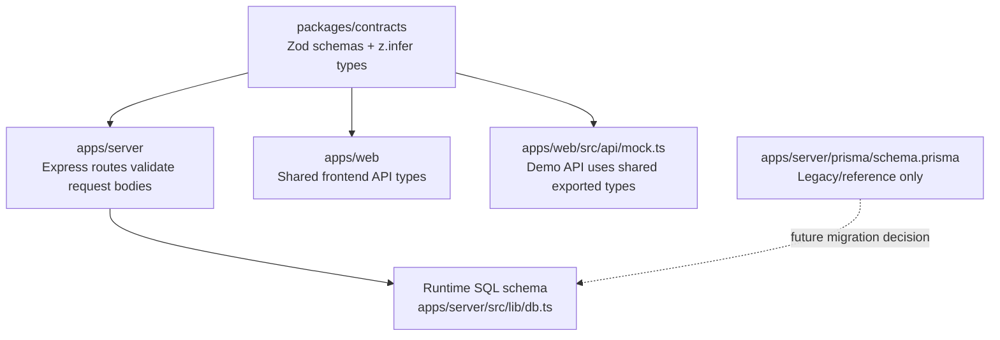

# Phase 1: Repository stabilization and source-of-truth alignment

## Decision summary

Phase 1 establishes `packages/contracts` as the shared API contract workspace. Runtime request validation and generated TypeScript types now come from Zod schemas exported by `@cyberpath/contracts`.

For persistence, the application continues to use the existing runtime SQL layer in `apps/server/src/lib/db.ts` as the operational source of truth. The Prisma schema remains as a legacy/reference artifact until a future migration can either fully adopt Prisma migrations or remove Prisma entirely. Phase 1 does not change database behavior.

## Architecture diagram

## Migration notes

- Add new contracts with `npm install` so the workspace package is linked through the root lockfile.
- Build contracts before server and web packages: `npm run build --workspace @cyberpath/contracts`.
- Import API request schemas from `@cyberpath/contracts` rather than redefining Zod schemas in route files.
- Import frontend API/domain types from `@cyberpath/contracts` through `apps/web/src/types/index.ts`.
- Keep runtime SQL unchanged for Phase 1; do not run a database migration for this change.

## Risks

- Some older domain-only types are intentionally exported as TypeScript aliases while API boundary contracts are backed by Zod schemas. Future phases should add schemas for every non-API domain object before enforcing runtime parsing on every response.
- Prisma and runtime SQL still coexist. The explicit Phase 1 decision is runtime SQL, but a later cleanup should either remove Prisma artifacts or introduce Prisma as the migration/runtime owner.
- The mock API is type-aligned with the contracts, but not every mock response is runtime-validated yet.
